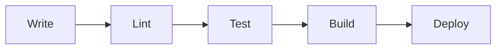
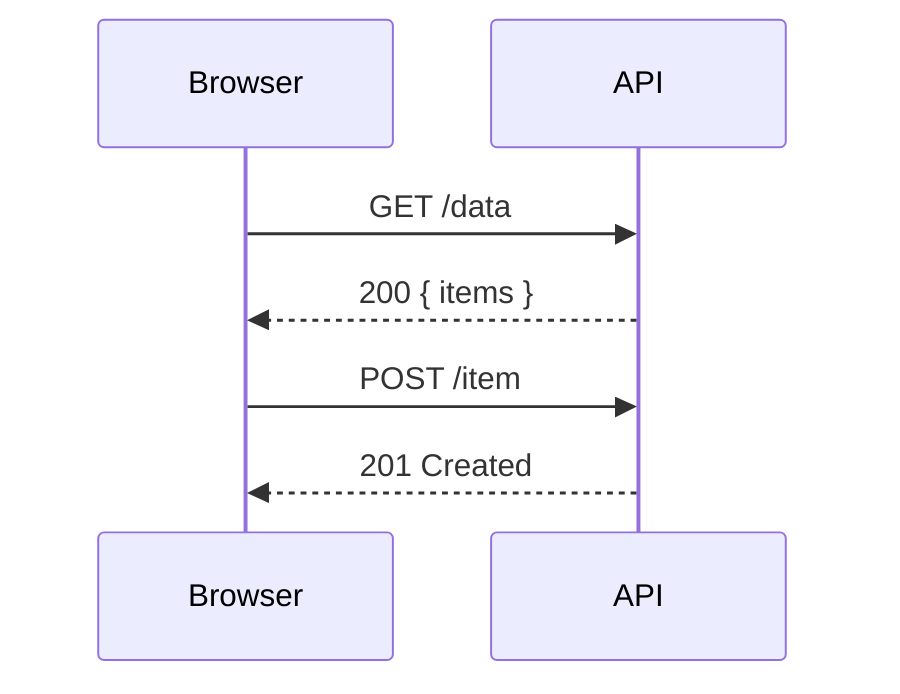
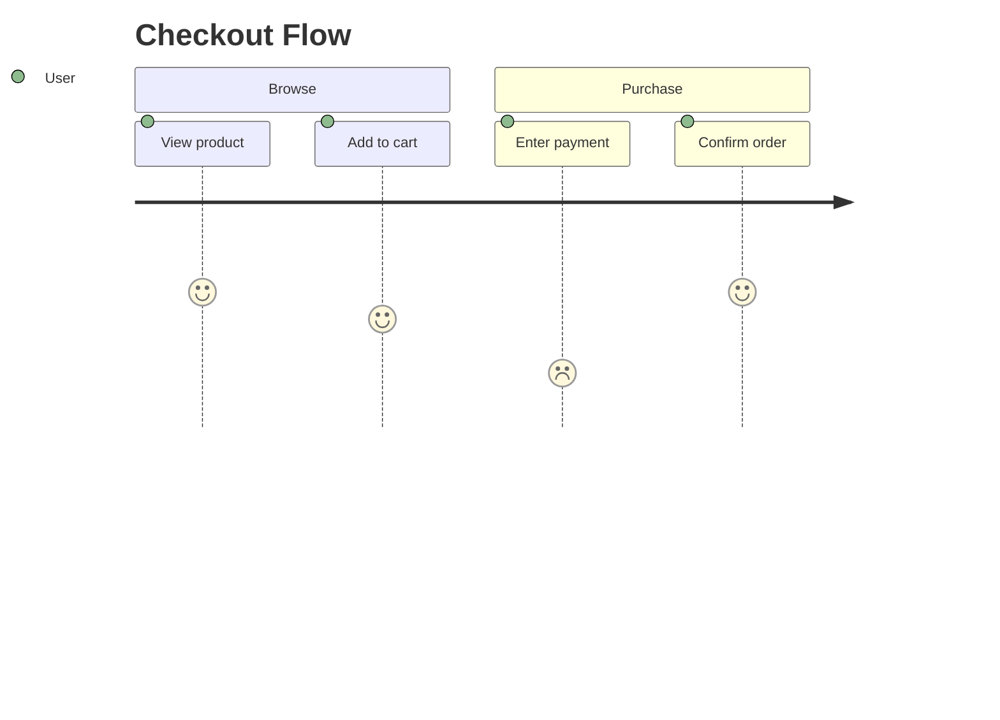

This post is a scratch pad for verifying the mermaid diagram integration. Each section exercises a different authoring path.

## Fenced Block — Flowchart

## Fenced Block — Sequence Diagram

## Fenced Block — Journey (Raw)

## Direct JSX Component

<Mermaid chart={`graph TD
  A[Client] --> B{Authenticated?}
  B -->|Yes| C[Dashboard]
  B -->|No| D[Login Page]
  D --> E[Submit Credentials]
  E --> B`} />

## UserJourney Template Component

<UserJourney
  title="New User Onboarding"
  actor="User"
  sections={[
    {
      name: "Discovery",
      tasks: [
        { label: "Finds landing page", score: 4 },
        { label: "Reads features list", score: 3 },
        { label: "Clicks sign up", score: 4 }
      ]
    },
    {
      name: "Registration",
      tasks: [
        { label: "Enters email and password", score: 3 },
        { label: "Confirms email", score: 2 },
        { label: "Completes profile", score: 3 }
      ]
    },
    {
      name: "First Use",
      tasks: [
        { label: "Completes onboarding wizard", score: 3 },
        { label: "Creates first item", score: 5 },
        { label: "Shares with a teammate", score: 4 }
      ]
    }
  ]}
/>

## UserJourneyMap — Rich Component

<UserJourneyMap
  title="New User Onboarding"
  persona={{
    name: "Jamie Chen",
    role: "Product Manager",
    bio: "Mid-career PM at a SaaS company. Evaluates new tools for the team and needs to get colleagues on board quickly. Values speed and clarity over feature depth.",
  }}
  expectations={[
    "Understand the product's value within the first visit",
    "Sign up without friction or credit card required",
    "Reach a meaningful first result in under 10 minutes",
    "Feel confident enough to invite teammates"
  ]}
  phases={[
    {
      name: "Discovery",
      steps: [
        { id: 1, description: "Finds landing page via search", sentiment: 4, quote: "Looks professional" },
        { id: 2, description: "Reads headline and feature list", sentiment: 3 },
        { id: 3, description: "Clicks 'Get started free'", sentiment: 4 }
      ]
    },
    {
      name: "Sign Up",
      steps: [
        { id: 4, description: "Enters email and password", sentiment: 3 },
        { id: 5, description: "Checks inbox for verify email", sentiment: 2, quote: "Why do I have to do this now?" },
        { id: 6, description: "Clicks verify link", sentiment: 3 }
      ]
    },
    {
      name: "Onboarding",
      steps: [
        { id: 7, description: "Completes setup wizard", sentiment: 3 },
        { id: 8, description: "Imports sample data", sentiment: 4 },
        { id: 9, description: "Creates first item", sentiment: 5, quote: "This is exactly what I needed" }
      ]
    },
    {
      name: "Activation",
      steps: [
        { id: 10, description: "Explores dashboard", sentiment: 4 },
        { id: 11, description: "Invites a teammate", sentiment: 5 }
      ]
    }
  ]}
/>
