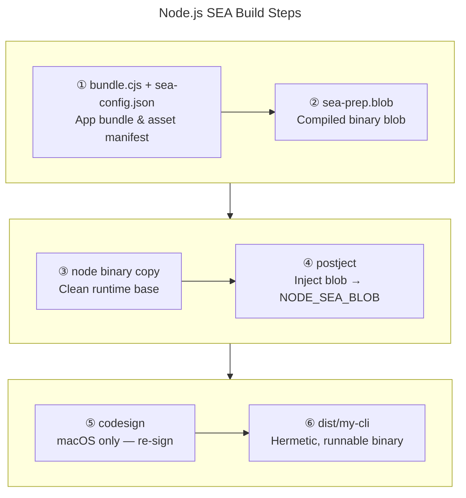
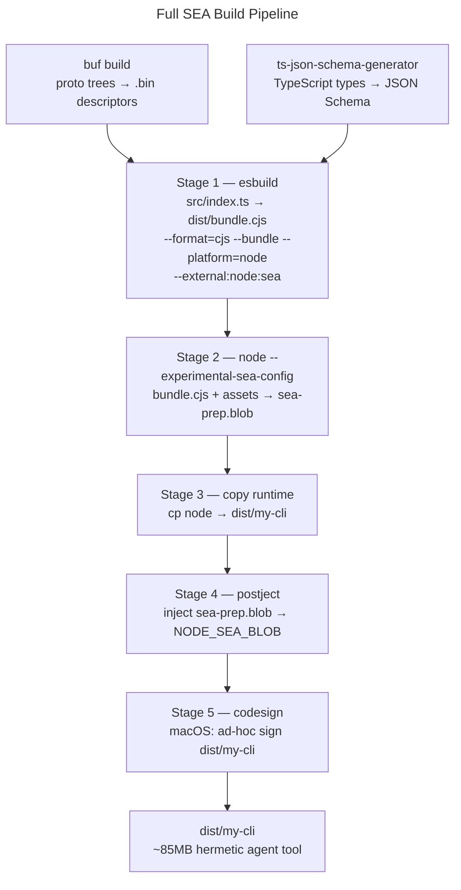
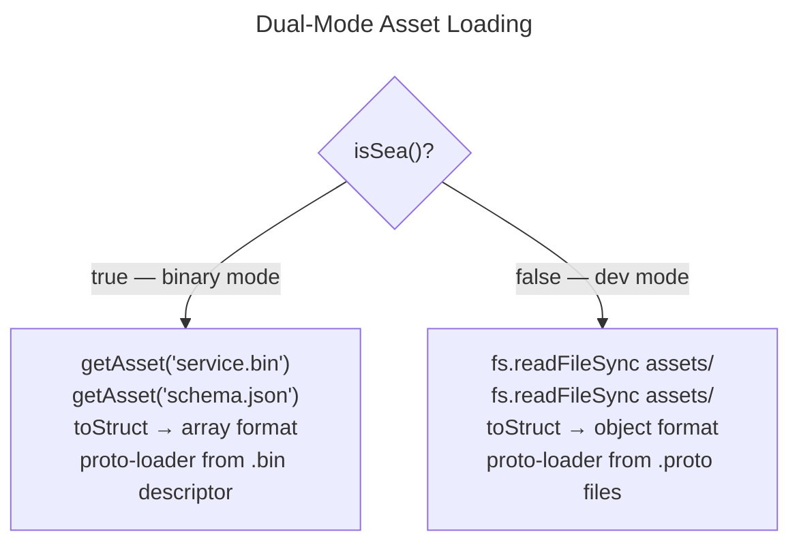

The most useful agent skills aren't wrappers around public APIs — they're tools that reach into your platform's own data. A skill that can search across live platform records, validate a proposed change against your actual schema, and then execute a multi-step write operation — creating a parent resource, capturing the DB-generated ID, and cascading it into dependent records — is doing something an agent can't do with generic tool-calling alone. That kind of logic lives in your application layer, not in any SDK.

The catch is delivery. That logic is usually tangled inside a monorepo: generated protobufs, gRPC clients, JSON Schema validators derived from application-layer TypeScript types. Packaging it so an agent can actually call it — one command, any environment, zero setup — is the unsolved part.

This case study covers how to package exactly that kind of CLI as a single hermetic binary using Node.js Single Executable Applications (SEA). The end result is an ~85MB file that gives an agent three capabilities it otherwise can't have: semantic search over platform data, validation against the real application schema, and multi-step CRUD with complex client logic all abstracted behind simple bash commands. No `npm install`, no `node_modules`, no proto files on disk.

The approach is loosely inspired by Go's single-binary distribution model. Node.js SEA achieves the same goal without a language migration.

---

## The Problem: Agents Need Hermetic Tools

For an agent to call a tool reliably, that tool needs to satisfy four properties:

**Single invocation.** One binary, predictable flags, no wrapper scripts. The agent constructs a command string and executes it. If that command string requires preconditions — a specific working directory, environment variables, installed runtimes — the agent has to reason about those preconditions, which it often gets wrong.

**Hermeticity.** No external dependencies to install or configure at runtime. The binary carries everything it needs. This is the hardest property to satisfy for Node.js tools, because Node's module system assumes `node_modules` is present on disk.

**Self-description.** Built-in `--help` that outputs structured, parseable text. Agents discover tool capabilities by reading help output. A tool with no help text or with help text that omits flags is effectively invisible to an agent.

**Round-trip stability.** Input and output formats that don't drift between versions. If the JSON schema the agent was trained on diverges from what the binary actually validates, the agent starts generating invalid payloads.

A typical monorepo CLI fails all four. It requires `node_modules`. It dynamically loads `.proto` files from sibling directories at runtime. It depends on environment setup that varies between developer machines and CI. Its types drift with the rest of the codebase.

Node.js SEA addresses the hermetic requirement directly. The rest is engineering discipline layered on top.

---

## What Node.js SEA Actually Does

Node.js SEA (introduced experimentally in v20, progressively stabilized through v22+) lets you inject a self-contained JavaScript blob into a copy of the Node.js runtime binary. The modified binary detects at startup that it contains an embedded application and runs it directly, bypassing the normal module resolution system.

The mechanism in six steps:



Step 2 uses `node --experimental-sea-config sea-config.json`, which compiles your bundle and any declared assets into `sea-prep.blob`. Step 4 uses `postject`, which injects the blob into a platform-specific named section: `NODE_SEA_BLOB` in Mach-O on macOS, ELF on Linux, or PE on Windows.

At runtime, the binary detects it is running as a SEA via the `isSea()` function from `node:sea` and retrieves embedded static assets via `getAsset(name)`, which returns an `ArrayBuffer`. This is the seam everything else pivots on.

**The CommonJS constraint.** SEA only supports CommonJS bundles — not ES modules. This isn't a subtle footgun; it determines your entire bundler configuration. Every transitive import must resolve cleanly through a CJS-compatible bundler. ESM-only packages become a blocklist item during dependency evaluation.

A minimal `sea-config.json`:

```json
{
  "main": "dist/bundle.cjs",
  "output": "sea-prep.blob",
  "useCodeCache": true,
  "assets": {
    "service-a.bin": "assets/service-a.bin",
    "service-b.bin": "assets/service-b.bin",
    "validation-schema.json": "assets/validation-schema.json"
  }
}
```

`useCodeCache: true` pre-compiles V8 bytecode into the blob, shaving startup time — relevant when an agent is calling the binary in a loop.

---

## The Monorepo Dependency Problem

Three categories of dependencies resist naive bundling and each requires a different strategy.

### Protobuf Definitions

A typical monorepo proto layout looks like this:

```
protos/
  service-a/
    v1/
      service.proto
      types.proto
  service-b/
    v1/
      service.proto
  common/
    v1/
      shared.proto
```

A CLI that loads protos at runtime with `@grpc/proto-loader` needs this entire directory tree present on disk, with import paths matching what the `.proto` files declare. That's incompatible with a hermetic binary.

The solution is Buf binary descriptors. `buf build` compiles each service's proto tree into a single binary `FileDescriptorSet` (`.bin` file):

```bash
buf build proto/service-a --output assets/service-a.bin --as-file-descriptor-set
buf build proto/service-b --output assets/service-b.bin --as-file-descriptor-set
```

Two files replace an entire directory tree. At runtime, load them from the embedded asset:

```typescript
import { isSea, getAsset } from 'node:sea';
import * as protoLoader from '@grpc/proto-loader';

function loadServiceDescriptor(name: string): Buffer {
  if (isSea()) {
    const ab = getAsset(`${name}.bin`);
    return Buffer.from(ab);
  }
  // Development: load from filesystem
  return fs.readFileSync(path.join(__dirname, `../../assets/${name}.bin`));
}

const packageDef = protoLoader.loadFileDescriptorSetFromBuffer(
  loadServiceDescriptor('service-a'),
  { keepCase: true, longs: String, enums: String, defaults: true, oneofs: true }
);
```

The binary descriptor is version-locked to the proto tree at build time. This is a feature when used as an agent tool — the validator never silently drifts.

### Validation Schemas

Application-layer TypeScript types — the request and response shapes your CLI validates — can be compiled to JSON Schema during pre-build using `ts-json-schema-generator`:

```bash
ts-json-schema-generator \
  --path src/types/requests.ts \
  --type CreateOrderRequest \
  --out assets/validation-schema.json
```

The schema is embedded as a SEA asset and loaded at startup:

```typescript
function loadSchema(): object {
  if (isSea()) {
    const ab = getAsset('validation-schema.json');
    return JSON.parse(Buffer.from(ab).toString('utf8'));
  }
  return JSON.parse(fs.readFileSync('./assets/validation-schema.json', 'utf8'));
}
```

Because schema generation runs as part of the pre-build hook, the embedded schema is always synchronized with the TypeScript types at the time the binary was cut. Agents get a validation contract that matches the binary's behavior exactly.

### The gRPC Client Layer

`@grpc/grpc-js` is pure JavaScript and bundles cleanly through esbuild. The impedance problem is at the wire format layer, covered below.

---

## The Build Pipeline

The full build is a sequential pipeline with a pre-build phase that generates artifacts:



As a `package.json` script:

```json
{
  "scripts": {
    "prebuild": "buf build proto/service-a -o assets/service-a.bin --as-file-descriptor-set && ts-json-schema-generator --path src/types/*.ts --type '*' -o assets/validation-schema.json",
    "build:bundle": "esbuild src/index.ts --bundle --platform=node --format=cjs --outfile=dist/bundle.cjs",
    "build:blob": "node --experimental-sea-config sea-config.json",
    "build:binary": "node -e \"require('fs').copyFileSync(process.execPath, 'dist/my-cli')\" && postject dist/my-cli NODE_SEA_BLOB sea-prep.blob --sentinel-fuse NODE_SEA_FUSE_fce680ab2cc467b6e072b8b5df1996b2",
    "build:sign": "codesign --sign - --force dist/my-cli",
    "build": "npm run build:bundle && npm run build:blob && npm run build:binary && npm run build:sign"
  }
}
```

The `NODE_SEA_FUSE_*` sentinel string in the `postject` call is how Node.js detects the injected blob at startup — it's a magic byte sequence searched in the binary.

---

## The Transport Layer Impedance Problem

This is the section that isn't in the documentation anywhere.

Buf's `create()` factory produces typed protobuf message instances compatible with Connect-RPC. `@grpc/grpc-js` with `proto-loader` does not accept these. It expects plain JavaScript objects with field names that match what the loader was configured to produce — either `snake_case` (with `keepCase: true`) or `camelCase` (default). Generated types are usable only as `import type` for TypeScript hints; they cannot be passed directly to grpc-js calls.

This is not a bug in either library. They implement different serialization pipelines. The mismatch is invisible until runtime.

### The google.protobuf.Struct Problem

`google.protobuf.Struct` is how protobuf represents arbitrary JSON-like objects. Neither grpc-js nor proto-loader auto-serializes a plain JS object into Struct wire format. You have to do it manually, and the required format differs between loading from a binary descriptor versus loading from `.proto` source:

| Format source | Field names | Map representation | Oneof discriminator |
|---|---|---|---|
| Binary descriptor (`.bin`) | `snake_case` | Array of `{key, value}` pairs | Absent |
| `.proto` source file | `camelCase` | Object `{key: value}` | `kind: "numberValue"` etc. |

This means any `Struct` conversion code must branch on `isSea()`:

```typescript
import { isSea } from 'node:sea';

function toStruct(obj: Record<string, unknown>) {
  if (isSea()) {
    // Binary descriptor mode: array of {key, value} pairs, snake_case
    return {
      fields: Object.entries(obj).map(([key, value]) => ({
        key,
        value: toStructValue(value)
      }))
    };
  }
  // Development proto-source mode: object map, camelCase, with kind discriminator
  return {
    fields: Object.fromEntries(
      Object.entries(obj).map(([key, value]) => [key, toStructValueDev(value)])
    )
  };
}
```

This is the most fragile part of the whole system. Test both paths in CI.

---

## Dual-Mode Operation

`isSea()` is the architectural seam between the binary (production) and filesystem (development) modes. Every resource that differs between modes gets a loader function that branches on it:



The pattern is consistent enough that it can be abstracted into a single `AssetLoader` class:

```typescript
class AssetLoader {
  static buffer(name: string): Buffer {
    if (isSea()) return Buffer.from(getAsset(name));
    return fs.readFileSync(path.join(ASSET_DIR, name));
  }

  static json<T>(name: string): T {
    return JSON.parse(AssetLoader.buffer(name).toString('utf8')) as T;
  }
}
```

Both modes must be exercised in CI. The binary mode can be tested by running `npm run build` in the pipeline and then executing the resulting binary against a test suite. Development mode runs normally with `ts-node` or `tsx`.

---

## Asset Strategy

What belongs embedded versus bundled is a meaningful decision:

| Resource type | Strategy | Reason |
|---|---|---|
| Proto binary descriptors (`.bin`) | Embedded SEA asset | Cannot be bundled as JS |
| JSON Schema | Embedded SEA asset | Runtime-loaded JSON |
| npm dependencies | Bundled into `bundle.cjs` | esbuild tree-shakes at build time |
| Configuration defaults | Bundled or embedded | Either works |
| `.proto` source files | **Do not embed** | Binary descriptors are the correct primitive |
| Native addons (`.node` files) | Cannot bundle | Hard blocker — see below |

Native addons are the primary blocker for Node.js SEA adoption. Any dependency that compiles a `.node` binary (common in crypto, database, or image processing packages) cannot be bundled and cannot be embedded. If your dependency graph includes native addons, you'll need to either replace them with pure-JS alternatives or accept that SEA isn't viable for that CLI.

---

## Platform Considerations

**Binary size.** The floor is approximately 85MB: the Node.js runtime contributes ~75MB, the SEA blob (bundle + assets) typically adds 1–3MB depending on dependency count. This is not reducible without building a custom Node.js binary, which is a separate project. For an agent tool distributed as a build artifact, 85MB is generally acceptable.

**macOS.** After `postject` modifies the binary, macOS's code signing validation kills it on launch (exit 137) unless you re-sign it. Ad-hoc signing (`codesign --sign -`) works locally and in CI. Distributing to other machines requires a Developer ID certificate and notarization through Apple's servers — a meaningful operational overhead if you're shipping to external users. For internal agent tooling, ad-hoc signing is sufficient.

**Linux.** No signing required. Build per platform for distribution. The Linux binary produced in CI is directly usable.

**Windows.** Standard injection path via `postject`. WSL is a practical alternative for agent environments that run on Linux anyway.

**CI matrix.** For multi-platform distribution, build on each target platform natively. Cross-compilation of the SEA binary is not straightforward because you'd need the correct platform's Node.js binary as the base, and the signing step is platform-specific.

---

## Version Locking and Schema Drift

The embedded artifacts — proto descriptors, JSON Schema — are locked to the monorepo state at the moment the binary was built. For agent tooling, this is a feature: an agent using `my-cli@1.4.2` gets the same validation behavior regardless of what has changed in the monorepo since that release.

The operational requirement this creates: **version the binary explicitly and surface it in `--version` output**. Agents should be able to report which schema generation was used, and the system deploying agent tools should be able to update binaries intentionally rather than accidentally.

The `prebuild` hook enforces regeneration on every build. There's no mechanism by which you can produce a binary with stale proto descriptors — the hook runs before esbuild, so the assets embedded in the blob are always from the current `buf build` run.

---

## Applicability to Agent Skill Design

The pattern generalizes. Any CLI that needs to carry complex application-layer knowledge into an environment where that knowledge can't be reconstructed follows the same shape:

1. **Identify shared artifacts.** What does the CLI need that can't be installed from a public registry? Proto definitions, internal schema types, validated configuration — these are the candidates.

2. **Generate binary forms at pre-build.** Source files become descriptors, TypeScript types become JSON Schema, config becomes JSON. The pre-build hook is the contract enforcement point.

3. **Embed as SEA assets, not source.** Binary descriptors are smaller, faster to load, and don't require the proto compiler to be present at runtime.

4. **Use `isSea()` as the clean seam.** Every resource that differs between production (binary) and development (filesystem) gets a loader function that branches on `isSea()`. Keep the branching logic centralized.

5. **Version the binary explicitly.** Agents need to know which contract they're operating against. `--version` should output enough information to trace the binary back to a specific monorepo commit or build artifact version.

6. **Ship one binary per platform as a build artifact.** Commit to the CI matrix early. The macOS signing story is the most operationally complex part of multi-platform distribution.

---

## Lessons Learned

**What works well.** Buf binary descriptors are a clean solution to the proto distribution problem — two files replace an entire directory tree and they load cleanly from an `ArrayBuffer`. `ts-json-schema-generator` gives you schema validation that's guaranteed in sync with your TypeScript types at build time. `isSea()` as a branching seam is simple and testable. Commander.js produces `--help` output that agents can parse reliably.

**What is hard.** The `google.protobuf.Struct` wire format difference between binary descriptor mode and proto-source mode is undocumented in `proto-loader` and requires runtime branching — it will bite you if you don't have integration tests that exercise both paths. The ~75MB binary size floor is non-negotiable without building a custom Node.js runtime. Native addon dependencies are a hard blocker. macOS ad-hoc signing only works locally; any broader distribution requires Developer ID infrastructure.

The Go single-binary model that inspired this approach doesn't have most of these problems because Go compiles everything — including the runtime — into the output binary with no external constraints. Node.js SEA achieves the same hermetic distribution property but carries the runtime cost and the CommonJS constraint. For teams already invested in a TypeScript monorepo who want to give agents access to complex application logic without a full rewrite, that tradeoff is usually worth it.
