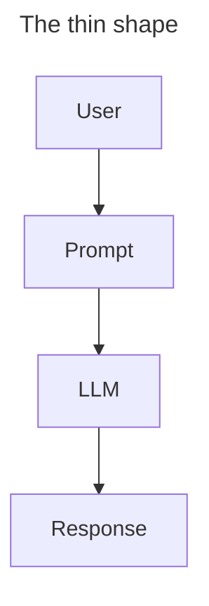
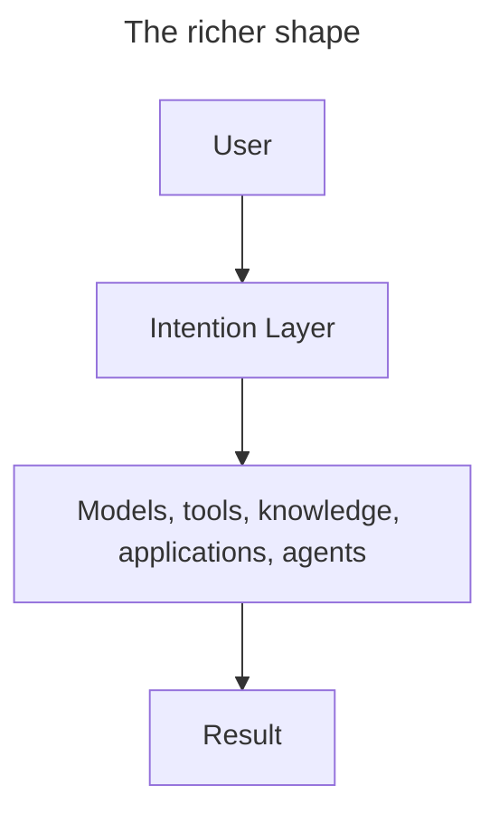

Software keeps moving responsibility away from people and into systems. We stopped asking most developers to think in machine instructions, then in manual memory layouts, then in DOM mutation by hand, then in physical servers. Each generation of tools creates a new layer that absorbs work humans used to manage directly.

AI gives us a chance to do the same thing for users.

Today, most AI products still treat the prompt as the primary interface. The user has to explain the task, choose the right level of detail, include the relevant context, phrase the request clearly, and often know which product surface or agent should handle the work. That is a lot of interface design hiding inside a text box.

I think we need a layer between the user and the model that treats human intention as the thing being served. I call it the **Intention Layer**.

## Users start with goals

Imagine someone needs to prepare for an executive meeting tomorrow. The work might involve Slack, Gmail, Salesforce, analytics dashboards, spreadsheets, and a slide deck. The software view of that task is a sequence of applications and operations. The human view is much simpler:

> Help me prepare for tomorrow's meeting.

That sentence is underspecified, but it is not vague. A competent system can infer a lot from it. It can look at the calendar, find the meeting, identify the attendees, gather recent context, inspect the account or project in question, and decide what kind of artifact would be useful.

The user's intention is not to open seven tools. The intention is to walk into the meeting prepared.

## Intent survives interface churn

Product surfaces change constantly. Navigation gets redesigned, buttons move, models improve, integrations come and go. The underlying jobs people bring to software are much more durable.

People want to understand a situation, compare options, produce an artifact, coordinate with others, make a decision, or remember something at the right time. Those goals show up across products and industries. They are not tied to a particular page or prompt format.

That makes intent a useful architectural primitive. If the product can represent intent explicitly, it can route work across changing tools without forcing the user to relearn the system every time the implementation changes.

## The missing layer

Many AI applications still have a very thin shape:

That is useful for experimentation, but it leaves too much work in the prompt. A production system usually needs a richer shape:

The Intention Layer decides what the user is trying to accomplish before deciding how the system should act. It may repair ambiguity, normalize language, assemble context, select tools, route capabilities, coordinate agents, and produce the final artifact. The model is still important, but it is no longer the entire product.

## The prompt is not the product

Prompt engineering has been useful because the underlying interfaces are still immature. Users learn formulas. Developers add longer system prompts. Products expose chat boxes where a more specific workflow probably belongs.

That does not feel like an endpoint. Good abstractions hide mechanical detail. People do not learn SQL to use search, and they do not study HTTP to use a website. Eventually, they should not need to learn the quirks of prompt construction to get reliable AI-assisted work.

The prompt should become an implementation detail. The user's intention should be the interface.

## Why "layer"?

I chose the word layer because I do not think this is only an assistant pattern. Assistants are products. Layers are infrastructure.

Operating systems have networking layers. Browsers have rendering layers. Applications have persistence layers. AI-native software needs an intention layer: a place where messy human input becomes structured work the system can execute.

That layer may be visible in some products and invisible in others. It may look like a chat box, a command menu, a workflow builder, or no dedicated interface at all. The important question is where the system places responsibility.

Does the user need to know which prompt, model, page, tool, or workflow will accomplish the task? Or can the product infer the intention and coordinate the work?

## The Intention Router

One component inside the Intention Layer is the **Intention Router**. Instead of routing URLs or API requests, it routes goals.

When someone asks for help preparing for tomorrow's meeting, the router might gather calendar context, summarize recent communication, retrieve CRM notes, pull relevant metrics, and generate a briefing document. The user made one request. The system coordinated several capabilities because it understood the job behind the request.

This is where AI product architecture starts to look different from traditional application architecture. The route is not a URL. The route is a user's desired outcome.

## What changes for UX

For years, product design has centered on controls: what should be visible, where it should live, and how the user should move through the flow. AI shifts more of that work toward intent design.

The central question becomes: how should this product understand and fulfill the goal the user is expressing?

That is not only a design question. Once a product accepts intention as input, the engineering system needs a place to interpret, normalize, route, and evaluate that intention. If those decisions live only inside prompts, they become hard to inspect and harder to improve.

The Intention Layer gives those decisions a home.

## A design philosophy

The Intention Layer is not a framework, library, or model. It is a way of designing software around the user's goal instead of the interface used to express it.

Sometimes the implementation will involve language models. Sometimes it will involve traditional APIs, deterministic workflows, retrieval systems, or humans in the loop. The implementation can vary. The product responsibility stays the same: understand what the user is trying to accomplish and carry that intention through the system faithfully.

Across this series, I will write about intention routers, intent normalization, skill composition, agent coordination, context assembly, artifact generation, and AI-native UX beyond chat.

Software has always existed to help people accomplish things. The Intention Layer is a proposal to make that goal explicit in the architecture.
