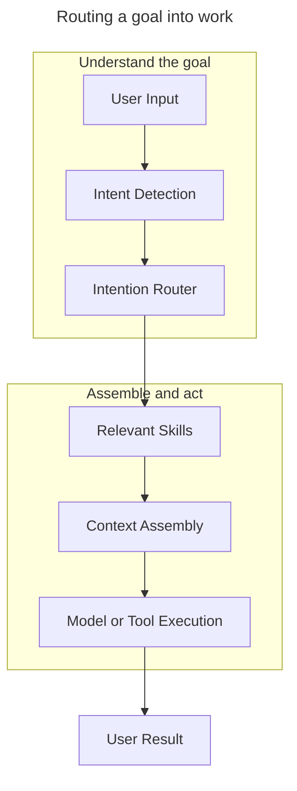

Most application architecture assumes the user is navigating to a known destination. A route maps a URL to a page, a button maps a click to an action, and a menu maps a label to a product surface. The system works because the user has already translated their goal into the application's structure.

AI products change that contract. A user may not ask to visit a report page or run a specific workflow. They may simply say:

> Show me how sales are doing this quarter.

The product has to decide what kind of request that is, which context matters, which tools should run, and what form the answer should take. That decision cannot be treated as an afterthought inside a prompt.

I call the component that makes this decision the **Intention Router**.

## From URL routing to intent routing

Web routers are explicit by design:

```text
/dashboard
/settings/profile
/customers/42
```

The route tells the application where the request belongs. The router does not need to infer much from the user's goal because the URL has already done that work.

AI requests are less explicit. "Compare this quarter against last year" could be a dashboard query, a written summary, a slide, a chart, or a follow-up question depending on the product and the user's context. "Summarize this for the board" implies a different audience and level of polish than "help me understand what happened."

The destination is no longer the stable input. The user's goal is.

## Intent is a better routing target

Interfaces change more often than the work people bring to them. A product may replace a page with a command palette, move a feature into an agent, or split a workflow across several tools. The user's intent still looks familiar: compare these numbers, explain this issue, prepare this document, notify this group, decide what to do next.

An Intention Router treats those goals as routable objects. Instead of beginning with a page, it begins with a model of the task:



The router's job is not to write the final answer. Its job is to decide what kind of work the system is about to perform.

That includes questions like:

- What is the user trying to accomplish?
- Which capabilities are relevant?
- Which data sources are required?
- Which tools should run?
- What context should be assembled?
- What artifact should be produced?

Those are product decisions as much as technical decisions. They determine what the user experiences as the product's intelligence.

## Skills instead of one giant prompt

Many AI products start with a large system prompt. That can work at first, but prompts become difficult to reason about as capabilities accumulate. Reporting instructions sit next to tone rules, safety constraints, tool descriptions, formatting guidance, and edge-case handling. Eventually, the prompt becomes the architecture.

An Intention Router suggests a more modular shape. Each capability can be represented as a skill with its own instructions, tools, guardrails, formatting expectations, and evaluation criteria. Reporting, search, email, calendar, CRM, analytics, translation, code generation, and presentation building do not need to live as one undifferentiated blob of instructions.

The router composes the skills that match the user's goal.

That gives teams a clearer place to put behavior. Instead of burying every decision inside one prompt, the system can route, compose, observe, and test capabilities directly.

## Routing is product judgment

Intent routing is not just classification. A router encodes what the product believes a request means.

Consider:

> Can you make this more executive-ready?

In one product, that might mean tightening the language. In another, it might mean adding financial framing, converting the document into slides, adding risks and recommendations, or preparing talking points. The same phrase can imply different work depending on the domain.

A useful Intention Router needs product knowledge. It needs to understand the user's language, the available capabilities, and the conventions of the environment where the work will land.

This is why intent routing belongs in the architecture. It is too important to hide as a casual prompt instruction.

## What changes for UX

Traditional UX asks how users move through surfaces. AI UX increasingly asks how users express goals and how products resolve those goals into action.

The user should not need to know which page to visit, which prompt to write, which API to call, or which model is best for the job. Those are implementation concerns. The product should give the user a reliable way to express intent, then do the routing work on their behalf.

That does not mean every interface becomes chat. In many cases the best intent interface may be a command menu, inline action, document affordance, workflow trigger, or ambient suggestion. The router can sit behind any of those surfaces.

## Why this matters

As applications become more agentic, complexity moves into coordination. Without structure, every feature becomes another prompt, every integration becomes another tool description, and every workflow depends on brittle reasoning at runtime.

Intent routing creates a layer where coordination decisions can be represented explicitly. The system can inspect why a skill was chosen, test routing behavior against examples, and improve the product without rewriting the entire prompt.

That layer sits between UI, prompting, and business logic. It is not a replacement for any of them. It is the part that decides how a human goal becomes system work.

## The Intention Layer

The Intention Router is one piece of the broader **Intention Layer**. The layer understands goals, normalizes language, assembles context, routes capabilities, coordinates agents, and shapes the final result.

The router is the mechanism that turns intention into action.

I do not think the future of AI software is that every product becomes a chat window. I think software will become better at understanding intent while the interfaces themselves become quieter. The router will usually be invisible to users, but it will define the shape of the experience.

Just as URL routers became a basic part of web development, intention routers will become a basic part of AI-native application architecture.
