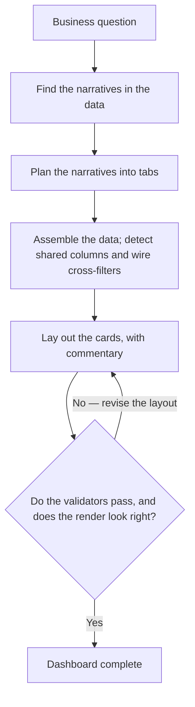
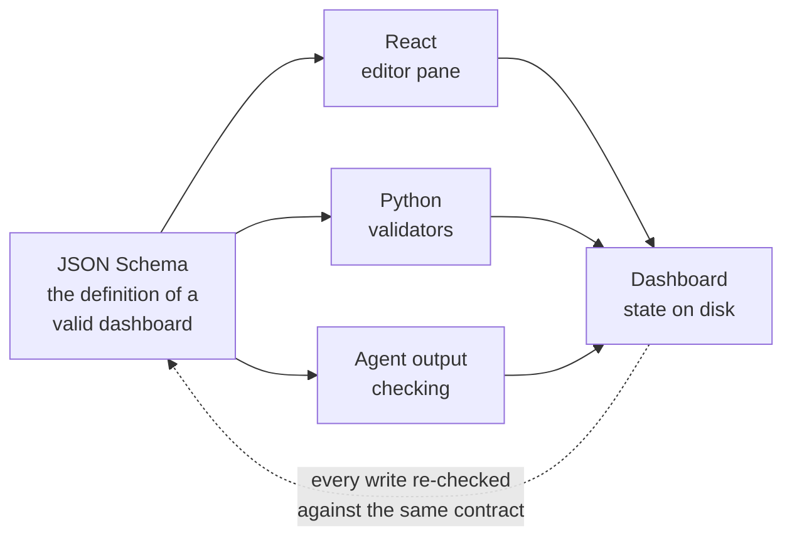
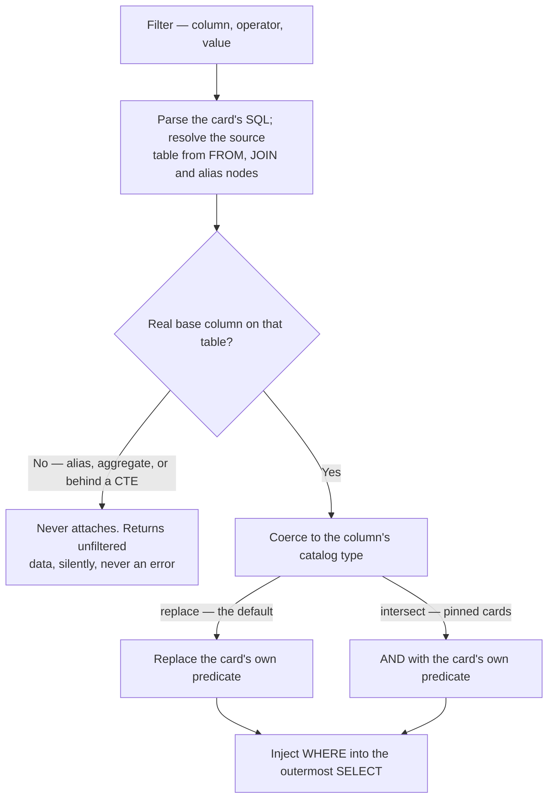

## The problem

Wholesale ops and finance teams have questions, not dashboards. What are my
warehouse forecasting issues. Where are my top sales opportunities. Answering
those normally means a BI ticket and a two-week queue, or a consulting
engagement that produces a static Power BI deck and a six-figure invoice.

{/* ALT (softer — drops the invented figure about someone else's business):
"...or a consulting engagement that produces a static Power BI deck and an
invoice sized to match." */}

## The product

Ask the question, get the dashboard. The agent finds the narrative in the data,
plans it into tabs, wires cross-filters and drilldowns, lays out charts with
written commentary, and validates the whole thing before it calls itself done.
Data stays live. You can then ask the dashboard follow-up questions,
holistically or one cell at a time.

## Architecture, in four layers

### 1. Agentic orchestration

Dashboard composition is decomposed into discrete stages, each backed by a skill
carrying its own examples and validators, one per card type. Find the
narratives. Plan them into tabs. Assemble the data. Detect column names shared
across sources and use them to drive cross-filters and drilldowns. Plot the
layout with commentary, as text blocks or as labeled conditional regions inside
a chart.

### 2. One schema, three runtimes

A JSON Schema layer is the single source of truth for what a valid dashboard is.
The same contract powers the React editor pane, the Python server-side
validators, and the agent's own output checking. Any setting a person can change
in the editor, the agent can change too, and neither can produce a state the
other rejects.

### 3. File-per-artifact packaging

Every chart is a file. Every query behind it is a file. The package is hoisted
and pulled up on read, so default filters can be coalesced, assembled, and
cached ahead of time rather than resolved per widget at render.

### 4. Rendering and the visual feedback loop

Adapters over Highcharts, ag-Grid powered tables, and fully custom views built
on TanStack. The agent gets a base64 render of the chart back, so it can see how
the UI actually drew the thing, not just what the validators were willing to
call valid configuration.

## Filter brokering

Filters are the part of a dashboard people actually touch, and they were the
hardest thing to make correct by construction.

A filter matches on column name — but a column name alone isn't enough to do
anything useful with. Each filter also needs a *source table*: something to
populate its dropdown from, to enumerate options against, to type its value by.
So the data endpoint takes the set of active filters plus the card's base query
and works backwards. It parses the card's SQL, walks the `FROM`, `JOIN` and
alias nodes to resolve which real table each filter column belongs to, and then
coerces the incoming value to that column's actual type. Some values want to
stay strings. Others have to become numbers before a `BETWEEN` will mean
anything.

Two rules make the rewrite safe. The filter only attaches when its column is a
genuine base column on a table the card reads directly — a `SELECT` alias or an
aggregate is invisible to the injection, and quietly does nothing rather than
erroring. And when the card's own SQL already constrains that column, the filter
*replaces* that predicate instead of AND-ing a duplicate, so a tab-level filter
cleanly overrides a card's built-in default. Cards whose identity is pinned to a
value — a KPI whose title says "2025" — opt into intersect mode instead, so a
mismatched filter returns no rows rather than silently relabelling the card.

That silent-skip path on the left is the whole reason the rest of the system is
strict about flat SQL. A filter that doesn't attach doesn't throw — it returns
perfectly plausible, completely unfiltered numbers. The only defence is making
it impossible to author one, which is what the validators do.

## The hard part

No cell returns an error. The goal was not an agent that generates dashboards,
it was a dashboard that is completely correct on the first pass. Every chart,
every query, every filter assembles and validates before the agent is permitted
to consider the job complete. Shared schema across the React, Python, and agent
layers is what makes that enforceable rather than aspirational, and the render
feedback loop is what catches the cases where valid configuration still looks
wrong.

## In practice

Built with the Fanatics wholesale sales team, with salespeople, warehousing, and
inventory cases at the center, extending out to financing and P&L views. The
result reads like a Big Four or MBB engagement handed your ops team a Looker
workspace, except it takes minutes, refreshes against live data, and answers
when you ask it something.

{/* ALT (plainer — same claim without the consulting-brand framing):
"The result gives an ops team the kind of analysis that normally arrives as a
consulting deliverable, except it takes minutes, refreshes against live data,
and answers when you ask it something." */}

## Results

- **100% of customers adopted it.**
- **5 to 20 minutes to insight**, down from a two-week BI queue.

{/* ALT (adds the denominator the "100%" is missing — fill in N):
"- **Adopted by all N accounts in the pilot.**" */}

---

React, TypeScript, JSON Schema, Python validators, Highcharts, ag-Grid,
TanStack, Claude Agent SDK.

*All figures shown are synthetic.*
