<!--
Archived from https://docs.summation.com/features/artifacts/dashboards
Retrieved 2026-10-01 (raw markdown via the .md endpoint). Images mirrored to ./images.
-->

> ## Documentation Index
> Fetch the complete documentation index at: https://docs.summation.com/llms.txt
> Use this file to discover all available pages before exploring further.

# Dashboards

> A live view of your key metrics to understand your business at a glance.

Dashboards are where your team goes to check the numbers. They stay current on their own, so nobody has to request an update or wonder whether they're looking at last month's figures.

A **dashboard** (`.sdash`) is a grid of **cards** (charts, KPIs, tables, and more) that update automatically as your data changes. A dashboard can have multiple **tabs**, each its own grid of cards. Dashboards are an [artifact](/features/artifacts) and live inside a [project](/features/projects).

<Frame caption="An example dashboard: KPI, chart, and table cards on a grid">
  
</Frame>

**Where each action lives in the UI** (for telling users where to click):

* **Dashboards home**: the **Dashboards** entry in the left nav sidebar (`/dashboards`): a table of your dashboards across all projects, with **Search**, a **Create** menu (Start with Addison / Start from scratch), and a per-row **⋯** menu (Open in new tab, Rename, Duplicate, Delete).
* **Dashboard editor** (`/projects/{projectId}/dashboards/{dashboardId}`): an **Edit** button enters edit mode, with a card palette in the toolbar (**Add Chart / Table / KPI / Text**, plus **Data Sources**) that you drag onto the grid, move/resize handles, a right-rail **card config pane**, and **Save / Cancel / Undo**. An **Edit with AI** button enters AI-edit mode. A **filter bar** sits above the grid.
* **Per card**: select a card for a small toolbar (it shows only while the card is selected and no popover is open). Its buttons depend on mode: **view mode**: **Ask**, **Edit with AI**, **More** (export image / data); **edit mode**: **Ask**, **Edit** (opens the config pane), **More**. There is no gear icon.
* **Not in the public API**: dashboards are managed in the app only. A dashboard's `.sdash` is a **folder package** (a directory on disk with a single file ID), reachable generically through the [files API](/features/projects#files), but there are no dashboard-specific public endpoints yet.

<Warning>
  Dashboard surfaces are enabled per workspace: the home and **Create**, edit mode and **Save**, the per-card **Ask** / **Edit with AI**, and the JSON editor. They are currently on for everyone, but where one is not enabled, that part of the UI won't appear.
</Warning>

<Info>
  Dashboards are app-only today: there are no dashboard endpoints. See [API coverage](/api/coverage) for what is planned.
</Info>

## Create a dashboard

Start a dashboard from the **Dashboards** page → **Create** (top-right), from a project's **Create → Dashboard**, or from the editor's empty state. There are two ways to build it:

* **Start with Addison**: describe what you want ("Revenue by region", "Headcount trends") and Addison builds the dashboard, streaming it live, the same way it [creates a report](/features/artifacts/reports#create-a-report).
* **Start from scratch**: a blank canvas you build yourself, card by card.

<Frame caption="The Dashboards page and its Create menu">
  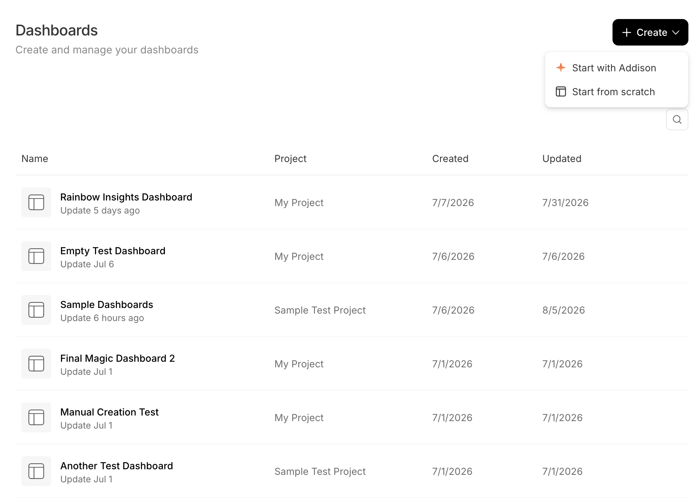
</Frame>

<Columns cols={2}>
  <Frame caption="Start with Addison">
    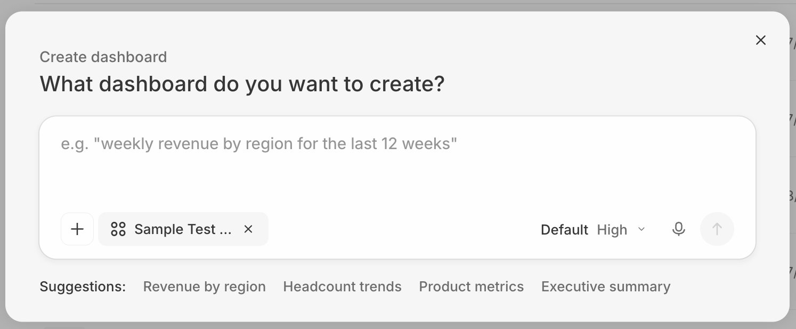
  </Frame>

  <Frame caption="Start from scratch">
    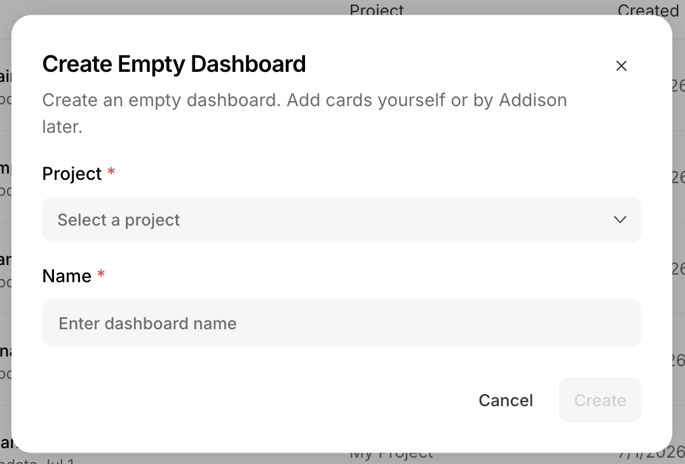
  </Frame>
</Columns>

**Two more ways:** from a project's **Create → Dashboard** (see [Create artifacts from project](/features/projects#create-artifacts-from-project)), or by **asking Addison in a chat** (see [Creating artifacts](/features/artifacts#creating-artifacts)).

## Find and open dashboards

The **Dashboards** page (shown above) lists your dashboards across all projects (Name, Project, Created, Updated) with search. Click one to open its editor. Dashboards are `.sdash` **folder packages**, so they also appear in their project's [file browser](/features/projects#files).

## Data sources

A dashboard's **data sources** are the tables it pulls from. Open the **Data Sources** panel in the edit toolbar to add and manage them, listed under **Tables** and **SQL Queries**. Once added, a source is available when you set up a card, and its columns become available as [filter](#filters) options.

<Columns cols={2}>
  <Frame caption="The Data Sources panel">
    
  </Frame>

  <Frame caption="Add a table from the Summation Data Grid">
    
  </Frame>
</Columns>

There are two kinds of data sources:

* **Views**: point-and-click data setup, no SQL required. Pick tables, columns, filters, and aggregations through the config pane, and change them any time. Cards you build by hand use a view by default.
* **SQL**: a query written directly. It's more flexible but not editable by hand, and Addison writes most SQL-backed cards. You can still change a SQL card's **Card Type**, **Title**, **Style**, and **Filter behavior**, but not the query itself, which is marked **Read Only** in the config pane.

## Cards

A dashboard is a grid of **cards**.

| Card | What it shows |
| - | - |
| **KPI** | A single metric, optionally with a comparison |
| **Chart** | Bar, Line, Pie, Waterfall, Combo, Box plot, or Bullet |
| **Table** | Tabular data |
| **Text** | Narrative and commentary |
| **Heading** | Section labels |
| **Financial report** | A formatted financial statement. Not in the drag-and-drop palette (Addison adds it), but an existing one is fully configurable as a **Card Type**. |

## Build and edit

Click **Edit** to enter edit mode, then:

* **Add cards.** Open a palette from the toolbar (**Add Chart / Table / KPI / Text**, plus **Data Sources**) and drag a card onto the grid. Summation fills in the data and picks a sensible default setup. You can also drag a table straight onto the grid to build a chart from it. Cards you add manually always use a **view** (see [Data sources](#data-sources)).
* **Arrange.** Drag to move, and use the resize handles. Cards snap to a grid.
* **Act on a card.** Select it to reveal its toolbar (**Ask**, **Edit**, and **⋯**). **Edit** opens the [config pane](#configure-a-card).
* **Save.** Nothing saves automatically. Click **Save** when you're done, or **Undo** / **Cancel** to back out.

<Columns cols={2}>
  <Frame caption="Edit mode: drag a card from the palette onto the grid">
    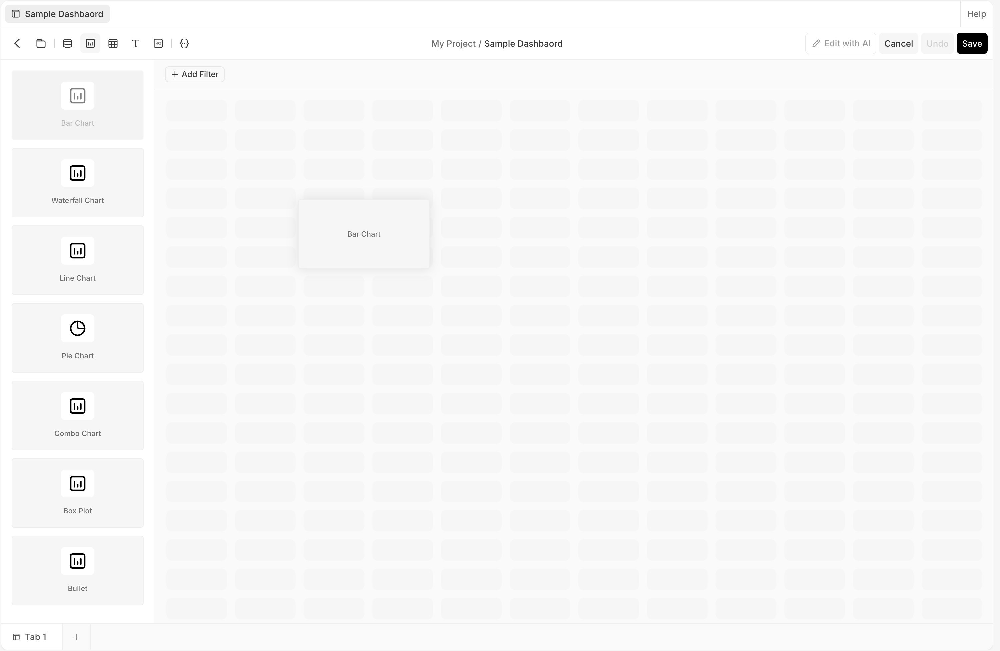
  </Frame>

  <Frame caption="A selected card in edit mode, with its toolbar">
    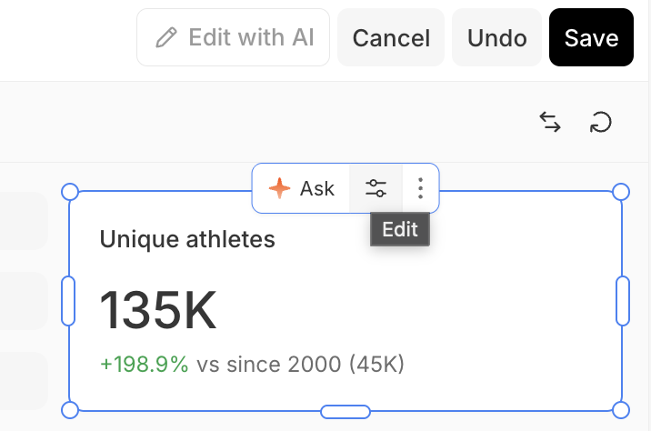
  </Frame>
</Columns>

## Configure a card

Select a card in edit mode and open its **config pane** (the right rail) from the card's **Edit** button. The pane has three tabs:

* **Data**: the data source and how it's shaped: **Select View**, row and column pivots, value, filter, and sorting.
* **Config**: the card itself: **Card Type**, title, data mapping (value column, comparison), and number format.
* **Style**: presentation: title, color scheme, orientation, legend, axes, and formats, for chart and non-pivoted table cards.

A card built on a **view** is fully editable. A card built on [SQL](#data-sources) has one restriction: its query is **Read Only**, so only Addison can change what data it returns. **Filter behavior**, **Card Type**, **Title**, and **Style** all stay editable.

<Columns cols={3}>
  <Frame caption="Data">
    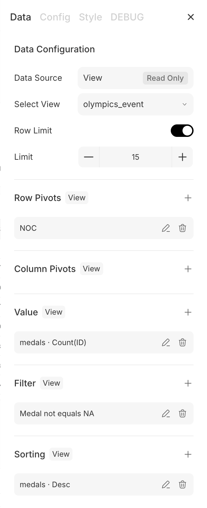
  </Frame>

  <Frame caption="Config">
    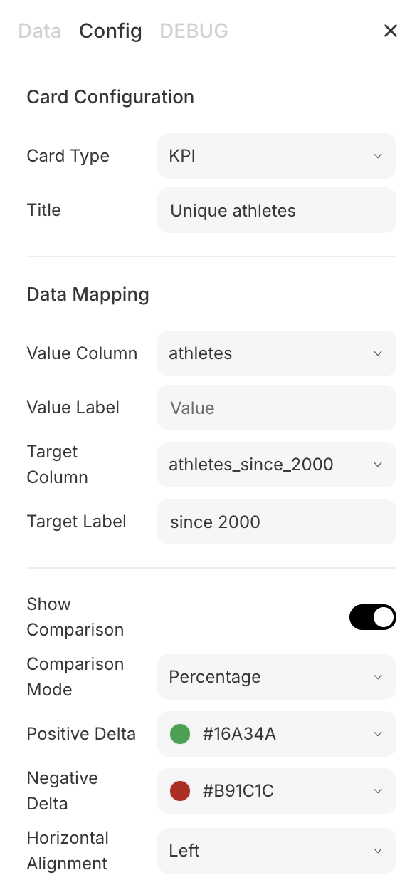
  </Frame>

  <Frame caption="Style">
    
  </Frame>
</Columns>

## Ask and edit with Addison

Dashboards aren't edited by typing. Select a card for its toolbar and pick:

* **Ask**: ask Addison a question about that card. The answer streams in the chat pane.
* **Edit with AI**: enter AI-edit mode, then select cards and describe the change you want. Edits queue in a bar ("N edits"), and **Submit** sends them to Addison as one request to apply.

<Frame caption="Select a card to Ask or Edit with AI">
  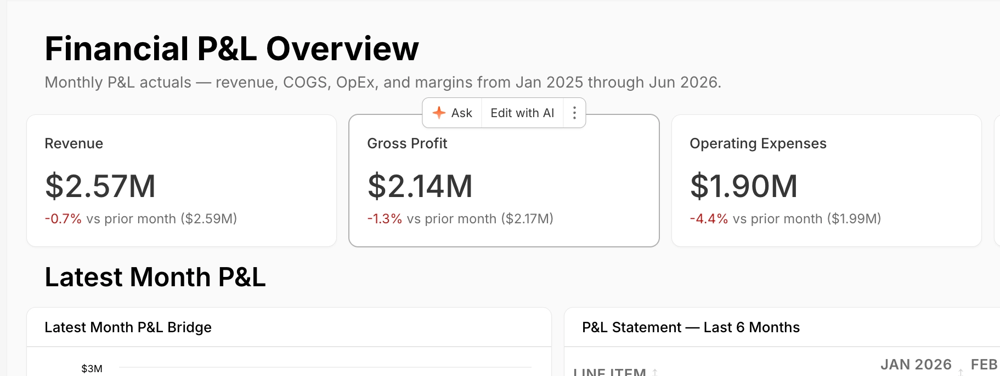
</Frame>

<Columns cols={2}>
  <Frame caption="Ask: question a card">
    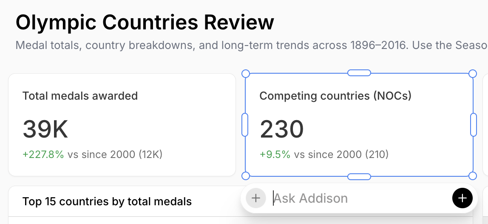
  </Frame>

  <Frame caption="Edit with AI: queue edits, then Submit">
    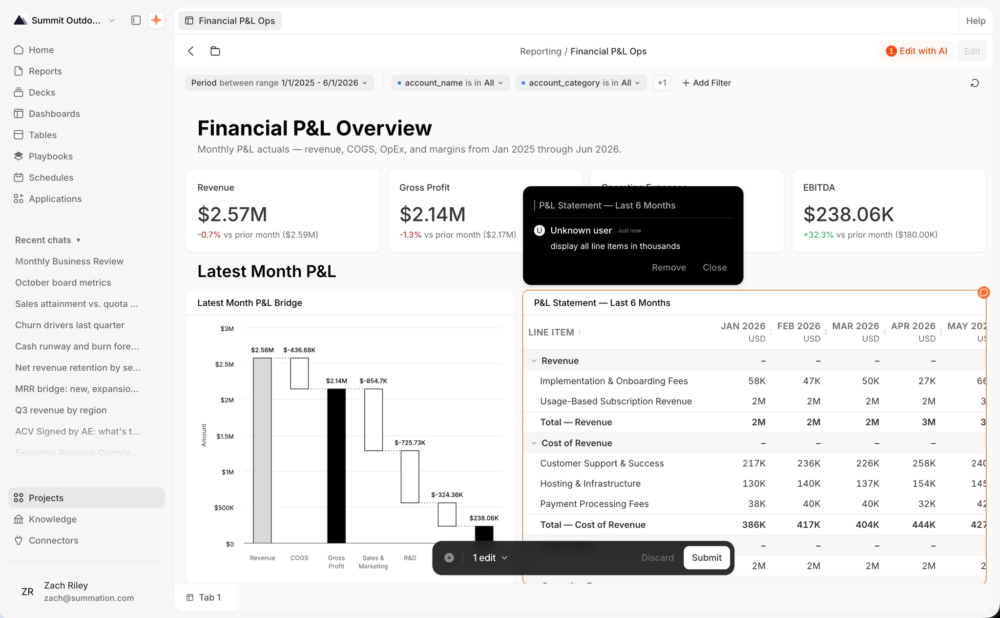
  </Frame>
</Columns>

## Filters

A **filter bar** above the grid filters every card at once. Click **Add Filter**, pick a column, then choose an operator and values. See [Appendix B](#appendix-b-dashboard-filters) for filter types and operators. Filters behave differently in each mode:

* **View mode**: filters you add here are **temporary**, for exploring. A **blue dot** marks them, and they last only for your session. To keep one, switch to **edit mode** and **Save**. Extra filters collapse into a **+N** dropdown.
* **Edit mode**: add, remove, and **Pin** filters. A pinned filter stays out front and isn't collapsed. The **reorder** button rearranges them, pinned among pinned and unpinned among unpinned. **Save** to persist.
* **Cross-filtering**: click a data point in a chart to filter every other card to that selection.

<Columns cols={2}>
  <Frame caption="A discrete filter: searchable multi-select">
    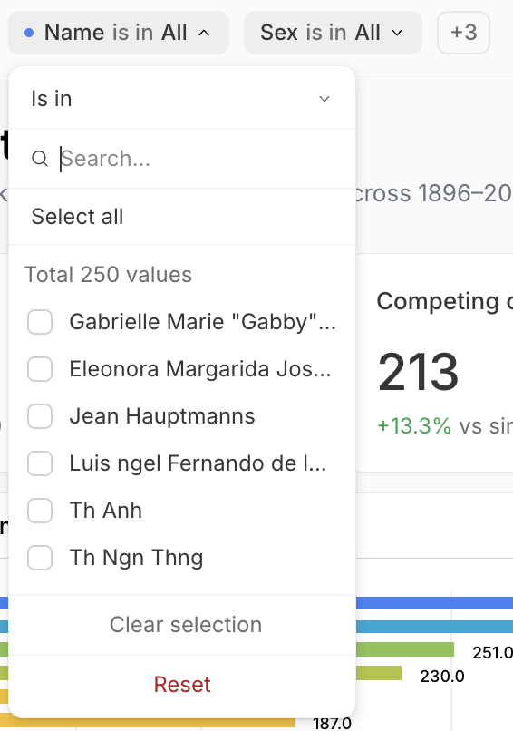
  </Frame>

  <Frame caption="A date filter: Period to Date presets">
    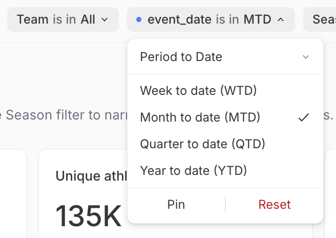
  </Frame>
</Columns>

<Frame caption="The filter bar: a temporary filter (blue dot), a +N collapse, and Add Filter">
  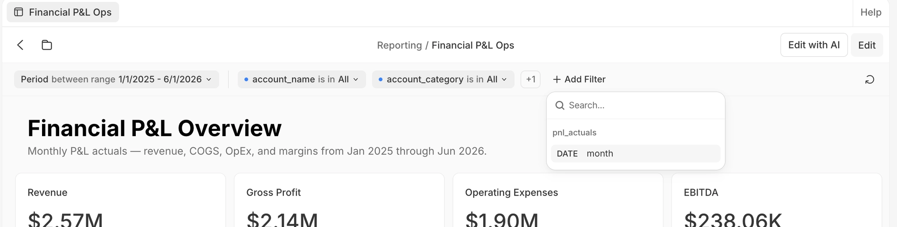
</Frame>

## Download

Dashboards download at the **card level**. From a card's **More** (⋯) menu, choose **Save image** / **Copy image** (PNG) or **Save data** / **Copy data** (CSV). You can also **Save the whole tab as an image**. Dashboard-wide PDF export isn't available yet.

<Frame caption="A card's More menu: Expand and download options">
  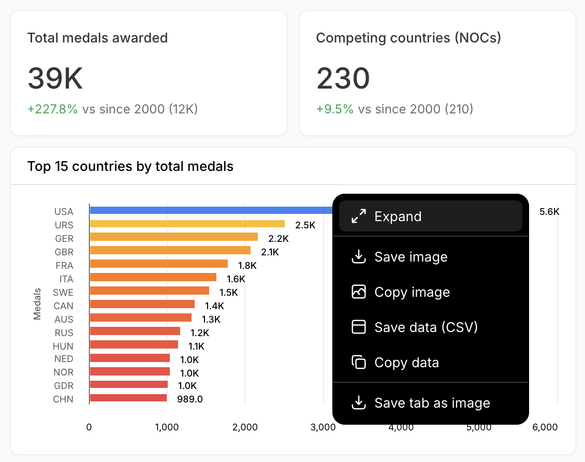
</Frame>

## Rename, duplicate, and delete

A dashboard is a `.sdash` **folder package** (a directory on disk with a single file ID). Rename, duplicate, or delete it from the [file browser](/features/projects#files)'s **⋯** menu, or from the row **⋯** on the Dashboards page (Open in new tab, Rename, Duplicate, Delete). Deleting can't be undone.

<Frame caption="A dashboard's row menu on the Dashboards page">
  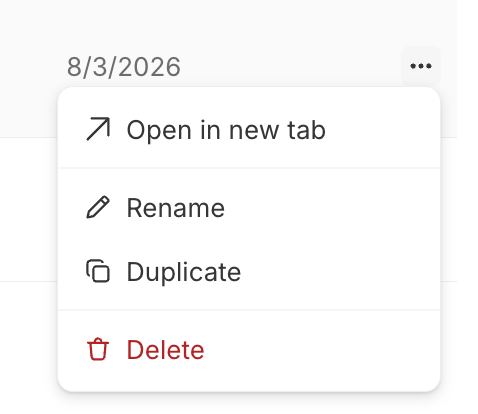
</Frame>

## Share and publish

Publishing a dashboard as a view-only link isn't available yet. For now, dashboards are viewed in the app by [project collaborators](/features/projects#collaborators). Reports do support [publishing](/features/artifacts/reports#share-and-publish).

## Appendix A: configurable options by card type

Everything below is set in the [card config pane](#configure-a-card). All data-backed cards share the same **Data** tab and some common **Config** controls. The per-type specifics follow.

<AccordionGroup>
  <Accordion title="Shared: Data tab (KPI, Chart, Table, Financial report)">
    View-backed cards:

    | Option | Values / notes |
    | - | - |
    | **Select View** | The data source |
    | **Row Limit** | Toggle, plus a row count |
    | **Row Pivots** / **Column Pivots** | Group-by and pivot columns |
    | **Value** | Column, aggregation (Sum / Count / Average / Min / Max / Median / Distinct count), and alias |
    | **Filter** | Column, operator (Equals, Not equals, Greater than, Greater than or equal, Less than, Less than or equal, Is one of, Is not one of, Between, Contains, Starts with, Ends with, Is null, Is not null), value, case-insensitive |
    | **Sorting** | A column or aggregation, Ascending / Descending |

    SQL-backed cards instead show **Filter behavior** (Replace or Intersect), controlling how tab filters combine with the card's own query.
  </Accordion>

  <Accordion title="Shared: Config tab (all cards)">
    | Option | Values / notes |
    | - | - |
    | **Card Type** | Chart / KPI / Table / Financial Report / Text / Heading |
    | **Title** | Text |
    | **Show Header** | Toggle (not on KPI or Heading) |
    | **Card Position** | X, Y, Width, Height |
    | **Type** | Read-only badge on Table / Financial report (Pivoted or Flat) |
  </Accordion>

  <Accordion title="KPI">
    Config tab (no Style tab):

    | Option | Values / notes |
    | - | - |
    | **Value Column** | Column |
    | **Value Label** | Text |
    | **Target Column** | Column (optional) |
    | **Target Label** | Text (when a target is set) |
    | **Show Comparison** | Toggle (needs a target) |
    | **Comparison Mode** | Percentage / Absolute |
    | **Horizontal Alignment** | Left / Center |
    | **Format** | Number / Currency / Percentage |
    | **Decimal Places** | 0–4 |
    | **Currency Symbol** | Text (when Currency) |
    | **Rounding** | Round / Floor / Ceil |
  </Accordion>

  <Accordion title="Chart">
    **Config (data mapping)**

    | Option | Values / notes |
    | - | - |
    | **X Field** | Category column |
    | **Y Columns** | Add, reorder, recolor, or remove each series |
    | **Derived series** | Rolling Average / Trendline / Moving Median / Exponential Smoothing, with a parameter (Window Size, Degree, or Alpha) |

    **Style → General**

    | Option | Values / notes |
    | - | - |
    | **Title** | Text |
    | **Color Scheme** | Default / Monochrome / Vibrant / Earth Tones / Cool Blues |
    | **Orientation** | Horizontal / Vertical |
    | **Stacking** | None / Normal / Percent |
    | **Background** | Color |
    | **Show Legend** | Toggle |
    | **Y-Axis** | Title, Show Title, Min / Max, Tick Interval (Auto / 1 / 5 / 10 / 50 / 100), Format, Decimals, Prefix, Suffix, Show Label |
    | **X-Axis** | Title, Show Title, Format (date, number, currency, percentage, compact, custom, or text case), Show Label |
    | **Annotations** | Bands (Fixed values / Percentile / Std deviation / Control limits / Custom) and Highlights (conditional, with color and label) |

    **Style → per series**

    | Option | Values / notes |
    | - | - |
    | **Chart Type** | Line / Bar / Area / Scatter / Waterfall / Pie / Bullet / Box Plot (mix types for a combo chart) |
    | **Display Name** | Text |
    | **Styling** | Colors, line/bar width, symbol and radius, axis side (Left / Right), pie labels, bullet targets, box-plot stats |
    | **Data Label** | Toggle, format, decimals, rounding, colors |
  </Accordion>

  <Accordion title="Table">
    **Config** (flat tables; hidden when pivoted)

    | Option | Values / notes |
    | - | - |
    | **Columns** | Add, reorder, **Pin** (None / Left / Right), or remove |

    **Style** (flat tables only, per column)

    | Option | Values / notes |
    | - | - |
    | **Header** | Text |
    | **Format** | Auto / Number / Currency / Percentage |
    | **Width** | Pixels |
  </Accordion>

  <Accordion title="Financial report">
    **Config** (hidden when pivoted)

    | Option | Values / notes |
    | - | - |
    | **Columns** | Add, reorder, or remove |
    | **Show Subtotals** | Toggle |
    | **Show Grand Total** | Toggle |

    **Style** (flat reports only, per column)

    | Option | Values / notes |
    | - | - |
    | **Type** | Label / Text / Numeric / Currency / Percentage / Percentage Bar |
    | **Display Name** | Text |
    | **Currency** | When Type = Currency |
    | **Width** | Pixels |
    | **Prefix** / **Suffix** | Text |
    | **Decimals** | 0–8 |
    | **Colorize Sign** | Toggle |
  </Accordion>

  <Accordion title="Text">
    Config only (no Data or Style tab):

    | Option | Values / notes |
    | - | - |
    | **Body Heading** | Text |
    | **Body** | Text |
    | **Horizontal** | Left / Center / Right |
    | **Vertical** | Top / Center / Bottom |
    | **Font Size** | 10–48 |
    | **Font Weight** | Normal / Medium / Bold |
    | **Background** / **Text** / **Links** | Colors |
  </Accordion>

  <Accordion title="Heading">
    Config only (no Data or Style tab):

    | Option | Values / notes |
    | - | - |
    | **Text** | Heading text |
    | **Level** | H1 / H2 / H3 / H4 |
    | **Size** | Number |
    | **Weight** | Light / Normal / Medium / Semibold / Bold |
    | **Color** | Color |
    | **Description** | Text, size, weight, color |
    | **Background** | Transparent toggle, plus color |
    | **Horizontal** / **Vertical** | Alignment |
    | **Padding** | Top / Right / Bottom / Left |
  </Accordion>
</AccordionGroup>

## Appendix B: dashboard filters

Add a filter from **Add Filter**, then pick a column. The operators available depend on the column's data type; the default is a **date range** for date columns and a multi-select (**Is in**) for everything else. Choose an operator and provide its input.

<AccordionGroup>
  <Accordion title="Text columns">
    | Operator | Expected input |
    | - | - |
    | **Is in** | A list of values (searchable multi-select) |
    | **Equal to** | A single value |
    | **Contains text** / **Starts with** / **Ends with** | A single text string |
  </Accordion>

  <Accordion title="Number columns">
    | Operator | Expected input |
    | - | - |
    | **Is in** | A list of values |
    | **Equal to** / **Not equal to** | A single value |
    | **Greater than** / **Less than** / **Greater than or equal to** / **Less than or equal to** | A single number |
    | **Between range** | Two numbers (from and to) |
  </Accordion>

  <Accordion title="Date columns">
    | Operator | Expected input |
    | - | - |
    | **Equal to** / **Not equal to** | A single date |
    | **Greater than** / **Less than** / **Greater than or equal to** / **Less than or equal to** | A single date |
    | **Between range** | Two dates (from and to) |
    | **Rolling Window** | A count and a unit (the last N days or months) |
    | **Period to Date** | Week (WTD), Month (MTD), Quarter (QTD), or Year (YTD) to date |

    <Frame caption="A date filter's operators">
      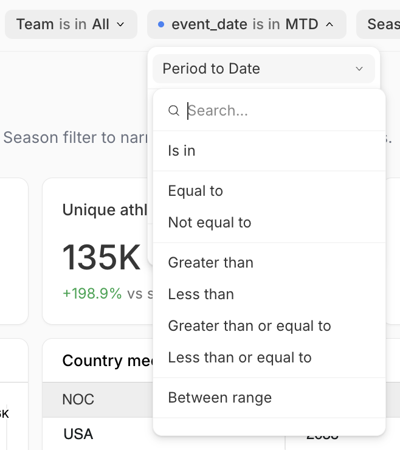
    </Frame>
  </Accordion>
</AccordionGroup>
